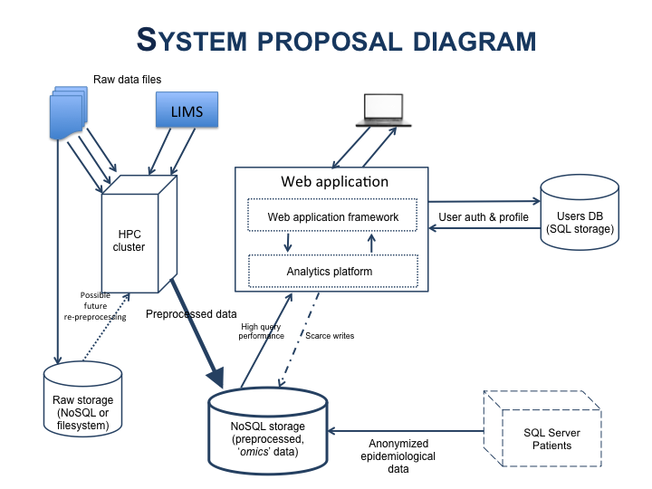

# Propuesta

### Diagrama de sistema ###

### Necesidades de datos ###
- __Usuarios__. Usuarios de la aplicación. Según lo especificado, se supone un máximo de 1000, probablmente menos según lo comentado. De cualquier manera, esa cantidad se adapta a un modelo SQL/Relacional. Implica guardar perfiles de usuario: permisos, preferencias, resultados, historia de operaciones...
- __Pacientes__. Los pacientes involucrados en el estudio están ahora mismo en una base de datos __SQL Server__. De acuerdo a los especificado, será necesario acceder a estos datos para realizar los análisis conjuntamente con los datos '_omics_'. Habrá que importar los datos anonimizados a una base de datos, en principio NoSQL. Usar un __API REST__ para acceder a ellos ralentizará sin duda las consultas de datos biológicos de acuedo con el caso de uso más o menos usual.
- __Raw data__. Estos son los datos procedentes directamente de la tecnología de secuenciación y generación de datos '_omics_' y que pasarán a ser preprocesados en el HPC Cluster. Se supone que estos datos se procesarán en principio una vez para obtener datos listos para su análisis y rara vez se accederá a ellos. Si esto es así, se podrían almacenar directamente los ficheros tal cual; si se prevé algún tipo de acción sobre ellos más o menos frecuente, habria que sopesar el guardarlos en un almacenamiento NoSQL porque se prevé un volumen de datos pues importante (un RDBMS no soportaría eficientemente una cantidad tan grande).
- __Omics data__. Datos preprocesados. No se ha proporcionado ningún indicativo de la cantidad de datos que pueden ser, pero lo puedo suponer entre centenas de GB y TBs. Esto es importante porque la propuesta es usar un __modelo NoSQL__ el cual no escala bien hacia abajo (si el volumen de datos es menor, del orden de decenas de GB o pocos cientos, el rendimiento se degrada). 
- __Logging__. Logs del uso de la aplicación por los usuarios y de los posibles errores en la carga de los datos 'omics' procedentes del preprocesado en el cluster. Hay que hacer una estimación del volumen y velocidad de generación de '_logging data_' y su posterior acceso y análisis para decidir entre un modelo de tabla relacional o NoSQL.

### Tecnologías ###
En lo que es el panorama de Big Data, que es de lo que parece que estamos hablando en la cuestión de los datos 'omics' que se van a analizar, hay múltiples opciones en tecnologías y soluciones. 

#### Consideraciones operacionales ####
Se supone que los datos '_omics_' no van a variar una vez cargados. Sin embargo, puede haber adiciones de más datos obtenidos de los análisis de los usuarios o después del preprocesado. Luego, las escrituras en esa base de datos van a ser escasas y, además, se supone que se antepone consistencia (que los datos que se requieren no estén 'sucios' -_dirty reads_-) a disponibilidad (al contrario que, por ejemplo, en un caso como el de Facebook). Lo mismo se supone con los datos epidemiológicos de los pacientes.

De cara a hacer análisis por parte de los usuarios, es importante que el acceso a datos debe tener un __tiempo de respuesta bajo__. Esto se consigue aplicando varias estrategias de configuración del sistema, diseño de la base de datos y desarrollo de las queries.

El volumen de datos que se espera de los _logs_ es bajo en comparación con los datos preprocesados, aunque es la única parte del sistema la cual está claro que crecerá en volumen de datos aunque no muy rápido aún pudiendo tener picos cuando muchos usuarios están trabajando simultáneamente.

#### Propuestas ####
Diferentes tipos de datos de diferentes orígenes implican, como casi siempre, una solución '_políglota_' de almacenamiento.

##### Datos biológicos/epidemiológicos: NoSQL #####
Los datos biológicos y epidemiológicos sujetos a análisis, de gran volumen y demandas de gran rendimiento, encajan en un __modelo NoSQL__. Parece claro de [http://www.ncbi.nlm.nih.gov/pubmed/25435347](http://www.ncbi.nlm.nih.gov/pubmed/25435347) que hay evidencia de que un sistema clásico no se comporta bien con estos volúmenes de datos. Sin haber podido reproducir el experimento del paper, estoy de acuerdo en que una posible solución para este proyecto puede se la que aportan los autores y es usar un modelo basado en un __stack de Hadoop__. 

Por otra parte, en [http://journalofbigdata.springeropen.com/articles/10.1186/s40537-015-0025-0](http://journalofbigdata.springeropen.com/articles/10.1186/s40537-015-0025-0), los autores hacen un (bastante) detallado análisis de las soluciones NoSQL existentes y encuentran que __MongoDB__ tiene un gran rendimiento en lecturas.

Otra cuestión a tener en cuenta es que, como se comentó, buena parte de la plataforma de análisis ya la aporta _tranSMART_, que es muy ineficiente para hacer análisis del tipo requerido por su backend en _Postgres_ u _Oracle_. Existen para Postgres la posibilidad de utilizar _Foreign Data Wrappers_ (__FDW__) a fin de poder utilizar tablas Postgres sobre Hadoop, aunque habría que modificar el DDL generado por tranSMART.

Sin conocer con más detalle las consultas que se harán sobre qué tipo de datos, es arriesgado dar una solución y sería interesante hacer un test no solo de lectura sino también de análisis sobre un conjunto de datos con  el __stack Hadoop__, __MongoDB__ y, si se decide por mantener _tranSMART_, con __Postgresql sobre Hadoop__, o sobre los dos primeros si se pueden de alguna manera obtener las herramientas de análisis necesarias para integrarlas en el __stack de Hadoop__ o __MongoDB__ (como comentamos en la entrevista, para no tener que empezar de cero y así cumplir un poco el DRY -Don't Repeat Yourself-).

Si esto no se pudiera hacer, el stack de Hadoop es atractivo: es ampliamente usado, con lo cual hay muchos recursos de documentación y soporte, tanto por parte de la comunidad como de cursos -gratis o no-, y mucho software alrededor de él. De hecho, Hadoop (y __HDFS__) sería la base sobre la que poner, por ejemplo:
- __HBase__, base de datos 'columnar' como sistema de almacenamiento distribuido
- __Spark__, motor para procesamiento de datos a gran escala
- __Phoenix__, procesamiento operacional con baja latencia
- __Atlas__, management & governance

Como contrapartida está su mantenimiento, que puede no ser sencillo en términos de administración y operación (_DevOps_). 

##### Usuarios: SQL #####
El número limitado de usuarios no hace aconsejable utilizar un sistema distribuido de alto rendimiento y un RDBMS servirá bien. No se harán escrituras en tiempo real ni lecturas masivas de datos a menos que los resultados de los análisis produzcan gran cantidad de datos (no se supone puesto que serán el resultado de una minería de datos).

##### Logs #####
Dependiendo del volumen de los logs, la velocidad de generación y si se hacen análisis sobre ellos. Probablemente una solución SQL sería apropiada, considerando además que buena parte de la información en él será relativa a la actividad de los usuarios.

##### Raw files: File system or NoSQL #####
Me refiero a los ficheros con datos para preprocesar en el cluster. Dependiendo de lo que se vaya a hacer con ellos y de su tamaño, la solución parsimoniosa sería no hacer nada, es decir, guardarlos en un disco tal cual. Esto suponiendo que apenas se van a usar ni hacer operaciones sobre ellos de manera más o menos frecuente. 

De otra manera, sería necesario una instancia de una base de datos NoSQL (que puede ser distinta a la usada para los datos preprocesados). Aquí me puedo inclinar en que los guardaría tal y como están porque es el origen de todo lo que se hará después e idealmente deberían existir mientras las muestras que los originaron existan.

### Web Application ###
El punto de entrada a los usuarios. Entiendo que sería algo como el interfaz de tranSMART,  "más moderno" si cabe. 

Como se ve en el diagrama, la capa analítica podría estar integrada en el web application framework o separada (si por ejemplo, se usara tranSMART de alguna manera). 

En cualquier caso, me inclino por una solución desacoplada, donde el cliente web haga peticiones REST al application framework y éste devuelva los resultados. De esta forma
- se puede crear un API (protegida) para acceso programático
- se pueden crear diferentes clientes, no sólo web

El application framework tendrá que realizar la autenticación y autorización de operaciones a los usuarios, probablemente usando algún componente de terceros, librería u otra framework para soportar la gestión de usuarios (roles, permisos, ...).

Destacar, por lo comentado en el mail, que no será esta parte de la aplicación como tal la que haga los análisis, sino que será probablemente la solución de big data analytics la que lo haga y devuelva los datos de los resultados a la aplicación web, que los guardará como datos de usuario y será quien los visualice.

### Integración del preprocesamiento ###
Conceptualmente, aquí se supone que se está hablando de una carga de datos de un fichero en una base de datos, lo que se da en llamar '_bulk load_', con el uso de un loader para convertir los datos al formato de la BD. Las dos particularidades que se comentan.

##### Recolección y almacenamiento de resultados del cluster #####
Aquí se supone, como comentamos, que los programas de preprocesamiento generan un fichero de datos preprocesados que se quedan en el cluster. Utilizando el comando `qsub` se puede enviar un correo electrónico cuando el trabajo se ha terminado. Conceptualmente, a partir de ahí se debería acceder al fichero resultado y empezar a almacenar los datos. Esto se puede hacer siempre que se pueda acceder programáticamente al fichero en el cluster para leerlo e incorporarlo a la BD. Se supone que una vez guardados lo datos, el fichero se elimina. 

##### LIMS #####
Se comenta que las unidades puede usar un LIMS para lanzar los ficheros raw al cluster. Haría falta sabe si este LIMS tiene acceso a los resultados producidos. También, qué hace este sistema con los datos brutos generados, ya que puede influir en el almacenamiento de los datos brutos comentado antes.

### Bonus ###
Buscando documentación, he encontrado una herramienta que os puede servir de mucho. Se llama [Zeppelin](http://zeppelin.apache.org), parece algo como un cuaderno de laboratorio y se integra con el stack de Hadoop. Es un futurible porque si se pincha en el enlace, todas las versiones aparecen como '_incubating_', lo que no es muy tentador ahora mismo.
